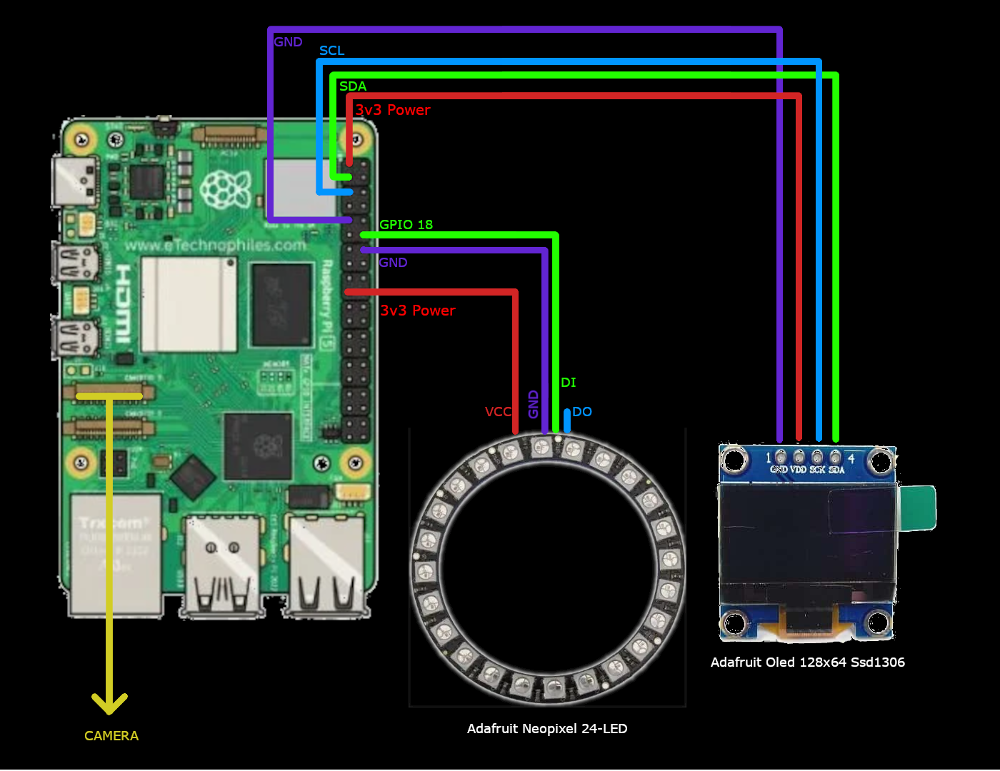

# EyeAria

Vizuální nástroj pro stavbu AI a IoT datových toků (pipelines). Projekt využívá framework [NiceGUI](https://nicegui.io/) pro interaktivní uživatelské rozhraní, Docker pro snadné nasazení a plně podporuje hardwarovou akceleraci včetně AI čipů Hailo.

## Funkce a vlastnosti
- **Vizuální editor (Canvas):** Intuitivní drag & drop rozhraní s podporou přibližování (zoom), posouvání a s interaktivní minimapou.
- **Automatické načítání uzlů:** Systém dynamicky načítá potřebné moduly (uzly) ze zdrojových souborů, což usnadňuje rozšiřování aplikace o nové prvky (např. kamera, filtry, AI).
- **Předletová kontrola:** Před každým startem datového toku (Pipeliny) proběhne kontrola vygenerovaného schématu, aby se předešlo spuštění se špatnou konfigurací uzlů.
- **Export a Import:** Svou vytvořenou strukturu si můžete pohodlně stáhnout do formátu JSON a kdykoliv později znovu načíst, a to včetně přesných pozic uzlů na plátně.
- **Integrovaný Dashboard:** Díky Streamlitu je možné přidat i komplexní datovou analytiku.

### Co je to Docker a proč ho používáme?

[Docker](https://www.docker.com/) je platforma, která umožňuje "zabalit" celou aplikaci i se všemi jejími závislostmi (knihovny, verze Pythonu, systémové nástroje) do izolovaného balíčku, kterému se říká **kontejner**. 

V kontextu projektu EyeAria přináší Docker několik klíčových výhod:
- **Konzistence:** Aplikace poběží naprosto stejně na vašem notebooku, na Raspberry Pi i na výkonném serveru. Zabraňuje se tak klasickému problému *"u mě to funguje"*.
- **Izolace:** Veškeré knihovny pro běh AI modelů a zpracování obrazu jsou uzavřeny v kontejneru a nijak neovlivňují zbytek vašeho operačního systému.
- **Jednoduché nasazení (Docker Compose):** Jak vidíte výše, pomocí jediného příkazu se dokáže spustit databáze, backendová aplikace s grafickým editorem i analytický dashboard, a to vše tak, že spolu tyto služby umí bezpečně a automaticky komunikovat po interní síti.

---

## Nasazení a instalace (Deployment)

Pro nasazení se využívá nástroj Docker Compose, který se postará o vytvoření sítě, databáze i kontejneru aplikace. Kontejner `eyearia` vyžaduje speciální oprávnění pro přímou komunikaci s hardwarem vašeho zařízení (GPIO, I2C, Hailo).

### Požadavky
- Nainstalovaný Docker a Docker Compose.

### Spuštění
V kořenové složce projektu (tam kde se nachází soubor `docker-compose.yml`) spusťte:

```bash
docker-compose up -d --build
```

Tento příkaz spustí na pozadí 3 služby:
1. **postgres** - PostgreSQL databázi na portu `5432`.
2. **eyearia** - Hlavní řídící aplikaci s grafickým editorem dostupnou na portu `8082`.
3. **dashboard** - Streamlit dashboard pro analýzu dat na portu `8501`.

*Poznámka:* Hlavní služba běží v režimu `privileged: true` pro získání přístupu k `/dev/hailo0`, `/dev/gpiomem`, `/dev/i2c-1` a připojeným kamerám přes `/dev/video0`.

---

## Zjednodušená instalace Hailo (např. Raspberry Pi 5)
Oficiální toturiál: https://www.raspberrypi.com/documentation/computers/ai.html#getting-started

Pro efektivní běh AI modelů projekt nativně podporuje hardwarový akcelerátor Hailo. Níže naleznete rychlý postup instalace ovladačů.

1. **Aktualizace systému:**
   Ujistěte se, že používáte nejnovější verze balíčků.
   ```bash
   sudo apt update && sudo apt full-upgrade -y
   ```

2. **Povolení rychlého PCIe (volitelné, ale doporučené):**
   Pro zajištění dostatečné propustnosti na Raspberry Pi 5 povolte PCIe Gen 3.
   ```bash
   sudo raspi-config
   ```
   *Jděte do `Advanced Options` -> `PCIe Speed` a zvolte `Gen 3`.*

3. **Instalace základních knihoven:**
   Nainstalujte kompletní balíček nástrojů Hailo.
   ```bash
   sudo apt install hailo-all
   ```

4. **Restart:**
   ```bash
   sudo reboot
   ```

Po restartu můžete ověřit funkčnost akcelerátoru například příkazem `hailortcli fw-control identify` nebo vyhledáním Hailo zprávy v jádře přes `dmesg | grep hailo`.

---

## Použití a Tutoriál

Jakmile je projekt nasazený přes Docker Compose, otevřete webový prohlížeč a přejděte na:
**`http://<IP_ADRESA_VAŠEHO_ZAŘÍZENÍ>:8082`**

### 1. Základy práce s plátnem
- Kliknutím a tažením po prázdné ploše (případně využíváním dotyku na mobilních zařízeních) se **posouváte** plátnem.
- Využijte tlačítka `+` a `-` v pravém dolním rohu nebo kolečko myši pro **přiblížení a oddálení** (zoom).
- Tlačítkem zaměřovače vpravo dole rychle **vycentrujete pohled**.
- Pro snazší navigaci u rozsáhlých projektů je v pravém horním rohu k dispozici živá **minimapa**.

### 2. Skládání Pipeliny
1. Tvorbu zahájíte stisknutím výrazného tlačítka **ADD SOURCE NODE** v centru plátna. Otevře se dialog pro výběr vstupního uzlu (Gateway, Kamera, apod.).
2. Další zpracovávací (Output) a řídící uzly přidáte přímo k existujícím uzlům přes kontextová tlačítka přímo na daném uzlu.
3. Uzly můžete po plátně jednoduše přesouvat, čáry a propojení se budou automaticky aktualizovat.
4. Nepotřebné uzly lze snadno smazat (s výjimkou základní Input Gateway).

### 3. Spuštění procesu
Jakmile máte všechny komponenty propojené, stiskněte nahoře v hlavní liště tlačítko **START PIPELINE**.
Před samotným startem systém zkompiluje logiku a zkontroluje propojení. Pokud projde "pre-flight check", zelené tlačítko se změní na červené a Pipelina začne zpracovávat data. Pro ukončení zpracování zvolte **STOP PIPELINE**.

### 4. Export a Import
Abyste nepřišli o svou práci, je v navigačním panelu zabudována funkce uložení.
- **Export (Ikona šipky dolů):** Vygeneruje `full_pipeline_config.json`, který obsahuje nastavení logiky i vizuální rozvržení prvků.
- **Import (Ikona šipky nahoru):** Otevře dialog pro bezpečné nahrání dříve vytvořeného konfiguračního souboru a okamžité obnovení plátna.

### 5. Bezpečnostní ukončení
V pravém horním rohu se nachází tlačítko **KILL**. Slouží jako bezprostřední pojistka pro kritické zastavení běhu celé aplikace (shutdown aplikaci i spojení).
```python

with open("README.md", "w", encoding="utf-8") as f:
    f.write(content)

print("Fetched content: README.md generated successfully.")

```

## Architektura a Datový tok (Data Flow)

EyeAria využívá uzlovou architekturu (node-based architecture), kde data plynou jedním směrem od zdrojů (Vstupů) k cílům (Výstupům/Zpracování). 

* **Input Nodes (Zdroje):** Získávají syrová data z okolního světa (např. MQTT, Kamera, senzory přes I2C).
* **Input Gateway (Rendezvous point):** Slouží jako hlavní křižovatka. Agreguje data ze všech vstupních uzlů a připravuje je pro další zpracování.
* **Processing Nodes (Zpracování):** Uzly připojené za Gateway (např. Hailo AI detekce, filtry). Odebírají data (Publish-Subscribe vzor), upravují je nebo obohacují o inference z AI.
* **Sink Nodes (Uložiště/Výstupy):** Koncové body jako `PostgresSink` (ukládání do databáze) nebo `MQTTSink` (odesílání do cloudu).

Před spuštěním samotného toku dat systém vždy provede **Pre-flight check**. Během něj hlavní Gateway vygeneruje `master_template` (očekávanou strukturu dat) a protlačí ji celým stromem uzlů (`push_schema`). Pokud některý uzel nahlásí nekompatibilitu vstupních dat, spuštění je bezpečně zrušeno.

## Pracovní postup (Project Workflow)

Typický životní cyklus práce s nástrojem EyeAria se skládá z následujících kroků:

* **Definice Vstupu:** Na plátno umístíte vstupní uzel (např. Kameru).
* **Připojení k bráně:** K tomuto zdroji se automaticky nebo ručně připojí "Input Gateway", která tvoří kořen vašeho datového stromu.
* **Skládání logiky:** Za bránu navážete další uzly (např. Hailo detekci objektů). Propojení se děje kliknutím na kontextová tlačítka přímo na uzlech.
* **Validace (Kompilace):** Při stisknutí "START PIPELINE" dojde nejprve k validaci logiky. Systém zkontroluje, zda na sebe uzly správně navazují.
* **Exekuce:** Po úspěšné kontrole se spustí nekonečná smyčka (případně asynchronní tasky), která začne čerpat data z hardwaru, prohánět je přes AI modely a ukládat do databáze.
* **Vizualizace a Analytika:** Paralelně běžící Streamlit Dashboard čte zpracovaná data z PostgreSQL databáze a vizualizuje je pro koncového uživatele.

## Komunikační matice (Communication Matrix)

Níže uvedená tabulka popisuje síťovou komunikaci mezi jednotlivými komponentami Dockerového nasazení a okolím.

| Zdroj | Cíl | Protokol | Port | Účel komunikace |
| :--- | :--- | :--- | :--- | :--- |
| **Klient (Web. prohlížeč)** | EyeAria Aplikace | HTTP/WS | `8082` | Přístup k vizuálnímu editoru a ovládání. |
| **Klient (Web. prohlížeč)** | Dashboard | HTTP | `8501` | Přístup ke Streamlit analytice. |
| **EyeAria Aplikace** | PostgreSQL | TCP | `5432` | Ukládání výsledků (např. logy nebo detekované objekty). |
| **Dashboard** | PostgreSQL | TCP | `5432` | Čtení zpracovaných dat pro vizualizaci. |
| **EyeAria Aplikace** | Host Hardware | Lokální | `/dev/*` | Přímá komunikace s Hailo (`/dev/hailo0`), GPIO, I2C a kamerou. |

## Katalog dostupných uzlů a jejich konfigurace (Node Directory)

EyeAria obsahuje modulární sadu uzlů. Zde je přehled jejich funkčnosti a konfiguračních polí, která u nich můžete v editoru nastavovat:

### ⚙️ Systémové uzly
* **Input Gateway:** Centrální křižovatka a kořenový uzel celé Pipeliny. Agreguje asynchronní data ze všech připojených vstupních senzorů a vytváří z nich synchronizovaný hlavní balíček. 
  * *Konfigurace:* Tento uzel nemá žádná nastavitelná pole, funguje zcela automaticky a nelze jej vymazat.

### 📥 Vstupní uzly (Sources)
* **Hailo:** Zajišťuje přísun obrazu a spouští na něm neuronové sítě (YOLOv8) pomocí akcelerátoru Hailo. 
  * *Zdroj dat (Source Config):* Přepínač mezi lokální kamerou (`Camera`) a síťovým streamem/souborem (`Stream/File`).
  * *Nastavení kamery:* Výběr fyzického zařízení, volba nativního rozlišení a FPS, možnost rotace obrazu (0-270°) a zrcadlení (Flip H / Flip V).
  * *Hailo Config:* Tlačítko s lupou pro vyhledání a výběr kategorizačního `.hef` modelu na disku (s automatickým filtrováním YOLOv8 modelů).
  * *Object Permanence:* Zapnutí sledování objektů napříč snímky (Tracker) s možností nastavit počet snímků pro udržení sledovaných a ztracených objektů v paměti.

* **MPU-9250 IMU:** Hardwarový senzor připojený přes I2C sběrnici dodávající data o zrychlení a natočení.
  * *I2C Config:* Nastavení I2C sběrnice (`I2C Bus`, výchozí 1) a hexadecimální adresy senzoru (`Address`, výchozí 0x68).
  * *Polling Rate (Hz):* Frekvence, jakou se mají číst data ze senzoru.

* **MQTT Source:** Přijímá data (JSON balíčky) z externích zařízení pomocí protokolu MQTT.
  * *MQTT Broker:* Nastavení adresy (`Broker Host`), portu a tématu (`Topic`). Port 8883 automaticky aktivuje zabezpečené TLS připojení.
  * *Credentials:* Volitelné přihlašovací údaje (`Username`, `Password`).

### 🧠 Logické uzly (Processing)
* **Filter:** Umožňuje filtrovat objekty pomocí vlastního skriptu.
  * *Python Logic:* Obsahuje integrovaný textový editor (s možností rozbalení na celou obrazovku), do kterého uživatel píše definici funkce `keep_detection(api, detection)`. Pokud funkce vrátí `False`, je objekt z datového toku zahozen.

* **Tagger:** Slouží k tvorbě logiky a přiřazování štítků (tagů).
  * *Python Logic:* Poskytuje editor kódu pro funkci `tag_detection(api, detection)`. Pomocí objektu `api.memory` si lze pamatovat stavy z předchozích snímků a přidávat objektům tagy (např. "Pohybuje se vlevo").

* **GPIO:** Spouští hardwarové akce (např. motory) na základě zachycených objektů.
  * *Rules (Pravidla):* Přepínač logiky `AND` / `OR`. Možnost přidávat podmínky definující, na co se má reagovat (např. `label == car` nebo `confidence > 0.8`).
  * *State Timeout:* Doba v sekundách, po kterou systém čeká, než přejde ze stavu ENTERED zpět do EXITED, pokud nevidí hledaný objekt.
  * *Enter/Exit Sequence:* Nástroj pro stavbu sekvence hardwarových akcí. Lze přidat pauzu (`WAIT` - čas v sekundách) nebo pohnout motorem (`SERVO` - volba pinu, rychlosti a trvání). Volitelně lze sekvenci opakovat (Repeat Sequence).

### 📤 Výstupní uzly (Sinks & Displays)
* **Visualizer:** Vykreslí aktuální ohraničující boxy na živý video-feed přímo v editoru.
  * *Display Config:* Rozevírací seznam `Target Camera Stream`, kde uživatel vybere, z jakého Hailo uzlu chce obraz sledovat (užitečné při zapojení více kamer).

* **Postgres Sink:** Provádí dlouhodobou archivaci detekcí do databáze PostgreSQL.
  * *Target Database:* Přihlašovací údaje k databázi (`Host / IP`, `Port`, `DB Name`, `User`, `Password`) s tlačítkem pro otestování spojení.
  * *Local Server Setup:* Správce lokální databáze (zobrazí se po kliknutí) pro inicializaci datového clusteru (nastavení `Data Directory Path`), spouštění serveru a vygenerování potřebných tabulek.

* **MQTT Sink:** Transformuje aktuální balíček do JSONu a odesílá ho přes síť.
  * *MQTT Broker & Credentials:* Stejné nastavení jako u MQTT Source (`Host`, `Port`, `Topic`, `Username`, `Password`).
  * Uzel navíc obsahuje živý, rozbalovací markdown log odesílaného JSON balíčku.

* **Tiny OLED Screen:** Generuje obraz pro malý externí I2C OLED displej přes síťový požadavek.
  * *Síťové parametry:* Nastavení cílové IP adresy, Portu a maximálního limitu snímků za sekundu (Max FPS).
  * *Mirror Display (Selfie Mode):* Zaškrtávací pole, které horizontálně převrátí vykreslené boxy.

* **Payload Viewer:** Vývojářský uzel, který zobrazuje strukturovaný strom aktuálních JSON dat prostupujících systémem.
  * *Freeze:* Jednoduchý přepínač, který "zamrazí" živý výpis dat na obrazovce pro snazší čtení a analýzu hodnot.

* **Logger:** Vypisuje informace do systémového terminálu (konzole).
  * *Logger Settings:* Přepínač formátu logování mezi stručným výpisem (`Summary` - vypíše jen počet detekcí) a kompletním stromem (`Full JSON`).

## Ukázkové Workflow: AI Pomodoro asistent (WorkflowDemo.json)

Soubor `WorkflowDemo.json` obsahuje předpřipravený datový tok, který funguje jako chytrý asistent pro dodržování pracovního režimu a přestávek. Využívá kameru a AI ke sledování toho, zda fyzicky sedíte u svého stolu.

### Architektura dema
Systém se skládá z následujících logických kroků a uzlů:

* **Hailo (Vstupní kamera):** Čte obraz z připojené kamery, automaticky jej rotuje o 180° a pomocí detekčního modelu YOLOv8 odesílá metadata o objektech v obraze dále do systému.
* **Tagger (Hlavní logika):** Mozek celého dema. Analyzuje zachycená data a hledá štítek `person`. Pokud osobu detekuje, počítá uběhlý čas. Pracovní úsek je zde pro rychlou ukázku zkrácen na 15 sekund a přestávka na 5 sekund. Uzel následně generuje globální události do paměti, jako např. `STATE:WORK_OK` (vše v pořádku) nebo `STATE:BREAK_VIOLATION` (pracujete přesčas).
* **Programmable LED:** Přijímá výstupy z Taggeru a vizualizuje čas pomocí připojeného LED pásku. Během práce se pásek postupně rozsvěcuje tlumenou bílou barvou, při přestávce naopak zelenou. Pokud režim porušíte (např. odejdete od stolu příliš brzy během práce), pásek vás upozorní červeným blikáním. Softwarově je uzel připojen na PIN 18 a jeho celkový jas je ztlumen na 10 % (0.1).
* **Tiny OLED Screen:** Slouží jako doplňkový informační displej. Na základě stavu generuje kontextové zprávy (např. "FOCUS MODE", "RELAXING...", "WHERE DID YOU GO?"). Komunikace z tohoto uzlu odchází přes síťové rozhraní na localhost IP `127.0.0.1` a port `8080`.
* **Visualizer:** Běží v uživatelském rozhraní a živě vykresluje bounding boxy detekované z uzlu Hailo.

### Jak zapojit hardware na Raspberry Pi
Pro správný běh tohoto konkrétního dema je nutné fyzicky zapojit hardware následujícím způsobem:

#### Kamera a AI Hailo:

Připojte kameru přes USB nebo CSI. Kontejnerová aplikace k ní má díky Docker konfiguraci nativní přístup (typicky přes /dev/video0).

Ujistěte se, že máte v M.2 nebo PCIe slotu připojený AI akcelerátor Hailo a nainstalované jeho základní knihovny na hostitelském RPi.

#### Programovatelný LED pásek/kruh (NeoPixel):

Datový PIN: Připojte řídící drát z LED pásku na GPIO 18 (což odpovídá fyzickému Pinu 12 na desce RPi).

GND: Propojte zem (GND) pásku s jakýmkoliv GND pinem na Raspberry Pi.

Napájení (5V): Doporučuji použít nezávislý externí zdroj napájení na 5V. V případě zapojování do 5V pinů samotného RPi buďte maximálně opatrní, RPi by mohlo při vyšším jasu/počtu LED shořet.

Docker běží v módu privileged: true, takže uzel pro ovládání LED diod získá ke /dev/gpiomem hardwarový přístup rovnou z aplikace a bude fungovat.

## Wiring diagram
