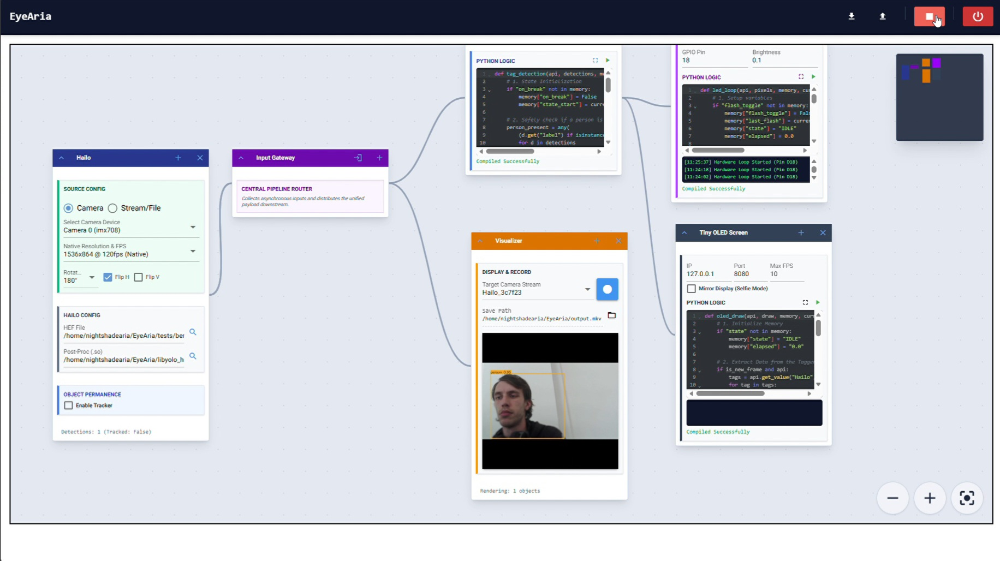

# EyeAria
Modulární systém pro nasazení lokální umělé inteligence (Edge AI) s přímou interakcí s hardwarem. Pomocí AI akcelerátorů (Hailo) a modelů hlubokého učení detekuje objekty v reálném čase a na základě výsledků automaticky ovládá fyzické periferie (displeje, LED signalizace, senzory, serva) s možností zobrazení a správy přes webový dashboard.

## Náhled architektury / zapojení
### Seznam modelů a dat:
Projekt využívá předtrénované modely rodiny YOLO (např. YOLOv8) zkompilované a optimalizované pro rychlou hardwarovou inferenci na NPU čipech Hailo-8.
### Seznam členů týmu:
Patrik Poklop

Ondřej Thomas

Tomáš Ladislav Kotek

### Link na aplikaci:
https://github.com/TheUltimateKrtek/EyeAria